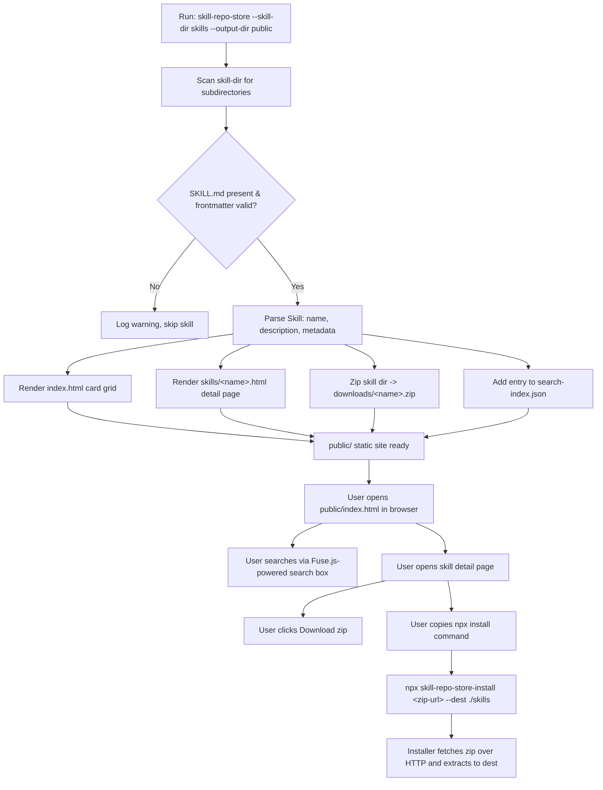
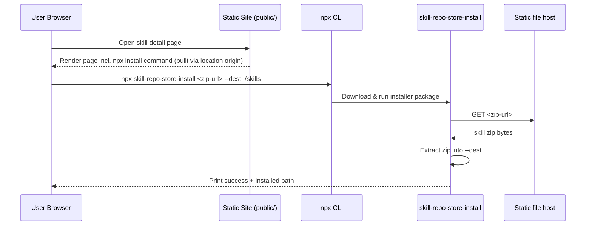

# Plan: Go-based static skill marketplace generator

## Overview
Build `skill-repo-store`, a Go/Cobra CLI that scans a directory of Claude Code skills
(default `skills/`, overridable via `--skill-dir`), parses each skill's `SKILL.md`
frontmatter, and generates a fully static "skill hub" website (default `public/`,
overridable via `--output-dir`) with a searchable card grid, per-skill detail pages,
zip downloads, and copy-paste `npx` install commands. The existing `skills/` directory
(46 real skills with varied frontmatter shapes) is used as the generator's sample data
and test fixtures — it is read-only input, never modified by this project.

### Flowchart

### Sequence

## Context
This is a brand-new project — no `go.mod`, no source files, not yet a git repo.
The only existing content is `skills/`, containing 46 real skill directories, each
with a `SKILL.md` whose frontmatter follows Anthropic's skill format but is
inconsistent in practice:

- Every skill has `name` and `description` (required, confirmed via survey of all 46).
- Some skills nest extra fields under a free-form `metadata:` map (`author`,
  `version`, `source`, `argument-hint`, ...) — see `skills/vue/SKILL.md` and
  `skills/web-design-guidelines/SKILL.md`.
- A few skills instead (or additionally) put `license` and `compatibility` as
  top-level frontmatter keys — see `skills/vueuse-functions/SKILL.md` and
  `skills/vue-best-practices/SKILL.md`.
- YAML indentation under `metadata:` is inconsistent (2-space vs 4-space) across
  skills — the parser must tolerate both.
- Skill directories commonly contain supporting files beyond `SKILL.md`
  (`references/*.md`, `LICENSE.md`, `SYNC.md`, images) — see `skills/vue/` — so zip
  downloads must package the whole directory, not just `SKILL.md`.

Because the output must be a pure static site (no server required to browse, search,
or download), search runs client-side (vendored Fuse.js) and the `npx` install
command is constructed in the browser via `location.origin`, so the generator never
needs to know its own future hosting URL at build time.

## Objective
Running `go build && ./skill-repo-store --skill-dir skills --output-dir public`
against this repo's real `skills/` directory produces a `public/` directory
containing: an `index.html` card grid listing all 46 valid skills, a detail page per
skill showing its parsed frontmatter/metadata, a downloadable `.zip` per skill under
`public/downloads/`, a working client-side fuzzy search box, and a copy-paste `npx`
install command per skill detail page. A companion `installer/` Node package can
fetch one of those zips by URL and extract it into a target directory. All of this
is verifiable by the scripted checks in each task below, plus `go test ./...`
passing project-wide.

## References
- `skills/vue/SKILL.md` — frontmatter with a nested `metadata` map (author, version,
  source) and a `references/` subdirectory to exercise whole-directory zipping.
- `skills/vueuse-functions/SKILL.md` — top-level `license` and `compatibility` keys
  outside `metadata`, plus 4-space YAML indentation — edge case for the parser.
- `skills/web-design-guidelines/SKILL.md` — `metadata.argument-hint` field, another
  free-form metadata key to confirm the parser doesn't require a fixed schema.
- `skills/asdp-create-plan/SKILL.md` — this plan's own source skill, no code
  relevance but useful as a "minimal" frontmatter (name + description only) fixture.

## Constraints / Scope

**In scope:**
- Go + Cobra CLI (`skill-repo-store`) with `--skill-dir` (default `skills`) and
  `--output-dir` (default `public`) flags on the root command, which performs
  generation directly (no `generate`/`serve` subcommands — confirmed with user).
- Frontmatter parsing tolerant of the real-world variance documented in Context.
- Static site: hand-written HTML via Go `html/template` + embedded assets
  (`go:embed`), no Node/JS build step for the site itself, no CSS framework.
- Client-side fuzzy search via a vendored Fuse.js build + a generated
  `search-index.json`.
- Per-skill `.zip` generated at build time via stdlib `archive/zip`.
- A separate, small Node package (`installer/`) providing the
  `skill-repo-store-install` CLI (invoked via `npx`) that downloads a zip URL and
  extracts it to a `--dest` directory.
- `skills/` used as the sample/fixture data for both manual runs and automated
  tests.

**Out of scope:**
- Publishing the `installer/` package to the npm registry (this plan ships the
  package source and its own tests; publishing/versioning is a follow-up).
- Hosting/deployment automation (e.g., CI to push `public/` to GitHub Pages).
- A local preview/serve subcommand (explicitly rejected by the user in favor of a
  single generate-only command).
- Authentication, private skills, or any non-static/backend behavior.
- Any tag/category taxonomy beyond what a skill's own `metadata` map already
  provides — no new classification scheme is invented.

**Non-negotiables:**
- `skills/` is read-only input to the generator; no task may modify its contents.
- The generator must remain a single self-contained Go binary — the `html/template`
  + `go:embed` site pipeline must not require Node/npm to run.
- `--skill-dir` and `--output-dir` must be real, working CLI flags with the stated
  defaults.
- A skill directory missing `SKILL.md` or with unparsable frontmatter must be
  skipped with a logged warning, not abort the whole build (confirmed with user).

## Tasks

### Task 1: Scaffold Go module, Cobra root command, and shared Skill type
- **Status**: done
- **Date**: 2026-09-15
- **Related file**: `go.mod`, `main.go`, `cmd/root.go`, `internal/skill/skill.go`
- **Objective**: Initialize the Go module (`go mod init skill-repo-store`), add a
  Cobra root command in `cmd/root.go` that accepts `--skill-dir` (default
  `"skills"`) and `--output-dir` (default `"public"`) and currently just logs the
  resolved flags, wire `main.go` to call `cmd.Execute()`, and define the shared
  `skill.Skill` struct in `internal/skill/skill.go` with fields `Name`,
  `Description string`; `Body string` (raw Markdown body below the frontmatter);
  `Metadata map[string]any` (catch-all for the nested `metadata:` block *and*
  every other top-level frontmatter key such as `license`, `compatibility`,
  `version`, `author` — see Task 2 for the full fold-in behavior); `DirName`,
  `DirPath string`. This struct is the contract every later task builds against.
- **Verification**: `go build ./...` succeeds; `go run . --help` output includes
  both `--skill-dir` and `--output-dir` flags with the correct default values shown.

### Task 2: Implement skill frontmatter parser (depends on Task 1)
- **Status**: done
- **Date**: 2026-09-15
- **Related file**: `internal/skill/parse.go`, `internal/skill/parse_test.go`
- **Objective**: Implement `ParseFrontmatter(path string) (*skill.Skill, error)` that
  reads a `SKILL.md` file, splits the leading `---`-delimited YAML frontmatter from
  the body, and unmarshals it (via `gopkg.in/yaml.v3`, into a `map[string]any`
  first) into a `skill.Skill`: `name`/`description` map to their typed fields
  (error if either is missing), a nested `metadata:` map is copied into
  `Metadata`, and *every other* top-level key (`license`, `compatibility`,
  `version`, `author`, `dependencies`, `argument-hint`, `allowed-tools`,
  `user-invocable`, etc. — whatever shape it is: string, list, or bool) is also
  folded into `Metadata` as-is, with no normalization. Tolerate both 2-space and
  4-space indentation under `metadata:`. Also capture the raw Markdown body (the
  content after the closing `---`) into a `Body string` field on `skill.Skill`.
  Return an error for missing `name`/`description` or malformed YAML.
- **Verification**: `go test ./internal/skill/... -run TestParseFrontmatter -v`
  passes, with subtests covering `skills/vue/SKILL.md` (nested metadata),
  `skills/vueuse-functions/SKILL.md` (top-level license/compatibility, 4-space
  indent), `skills/asdp-create-plan/SKILL.md` (minimal frontmatter),
  `skills/gitlab-cli/SKILL.md` (top-level `dependencies` list folded into
  `Metadata`), `skills/playwright-cli/SKILL.md` (top-level `allowed-tools` as a
  string folded into `Metadata`), and a `t.TempDir()`-generated malformed fixture
  that must return a non-nil error.

### Task 3: Implement skill directory scanner (depends on Task 1, Task 2)
- **Status**: done
- **Date**: 2026-09-15
- **Related file**: `internal/skill/scan.go`, `internal/skill/scan_test.go`
- **Objective**: Implement `ScanDir(root string) (skills []*skill.Skill, warnings
  []error)` that lists immediate subdirectories of `root`, calls
  `ParseFrontmatter` on each `<dir>/SKILL.md`, and on missing file or parse error
  appends a warning (with the skill dir name) to `warnings` and skips that skill
  rather than failing.
- **Verification**: `go test ./internal/skill/... -run TestScanDir -v` passes;
  a subtest runs `ScanDir("../../skills")` (the real fixture directory) and asserts
  `len(skills) == 46` with `len(warnings) == 0`, matching `ls -d skills/*/ | wc -l`;
  another subtest injects one broken skill dir into a `t.TempDir()` copy and asserts
  it is skipped with exactly one warning.

### Task 4: Implement HTML templates and site renderer (depends on Task 1)
- **Status**: done
- **Date**: 2026-09-15
- **Related file**: `internal/site/render.go`, `internal/site/templates/layout.html.tmpl`,
  `internal/site/templates/index.html.tmpl`, `internal/site/templates/skill.html.tmpl`
- **Objective**: Using `go:embed`, implement `Render(skills []*skill.Skill,
  outputDir string) error` that renders `index.html` (a responsive card grid — one
  card per skill showing name, truncated description, and any `Metadata`
  badges/tags present) and one `skills/<DirName>.html` detail page per skill
  (full description, a table of every key in `Metadata`, the skill's `Body`
  rendered to sanitized HTML via `github.com/yuin/goldmark`, and placeholder
  hooks — `id="download-link"` / `id="install-cmd"` — for Tasks 5 and 7 to fill in),
  writing everything under `outputDir`.
- **Verification**: `go test ./internal/site/... -run TestRender -v` passes using
  a small in-memory `[]*skill.Skill` fixture (2-3 synthetic skills) rendered into a
  `t.TempDir()`; assert `index.html` and each `skills/<name>.html` exist and contain
  the fixture skills' names via `strings.Contains`.

### Task 5: Implement per-skill zip downloads (depends on Task 1)
- **Status**: done
- **Date**: 2026-09-15
- **Related file**: `internal/site/zip.go`, `internal/site/zip_test.go`
- **Objective**: Implement `ZipSkillDir(s *skill.Skill, destZipPath string) error`
  using stdlib `archive/zip` to recursively archive the skill's entire source
  directory (`s.DirPath`) — including subdirectories like `references/` — into
  `destZipPath`, with every entry path prefixed by `<DirName>/` (e.g.
  `vue/SKILL.md`, `vue/references/advanced-patterns.md`) so extracting the zip at
  a destination reproduces a `<dest>/<DirName>/...` layout matching the
  `--skill-dir` convention.
- **Verification**: `go test ./internal/site/... -run TestZip -v` passes: zip
  `skills/vue` into a temp file, reopen it with `archive/zip.OpenReader`, and
  assert it contains both a `vue/SKILL.md` entry and at least one
  `vue/references/*.md` entry (not bare `SKILL.md` at the archive root).

### Task 6: Implement client-side search (depends on Task 1, Task 4)
- **Status**: done
- **Date**: 2026-09-15
- **Related file**: `internal/site/searchindex.go`, `internal/site/assets/fuse.min.js`,
  `internal/site/assets/app.js`, `internal/site/templates/index.html.tmpl`
- **Objective**: Implement `BuildSearchIndex(skills []*skill.Skill) ([]byte, error)`
  producing a JSON array of `{name, description, metadata}` written to
  `public/search-index.json`; vendor a Fuse.js build into `assets/fuse.min.js`;
  write `assets/app.js` to fetch the index, build a Fuse instance, and filter the
  card grid's DOM as the user types in a search box added to
  `templates/index.html.tmpl`.
- **Verification**: `go test ./internal/site/... -run TestSearchIndex -v` passes
  and produces valid JSON (`json.Valid`) with one entry per input skill; after a
  full generate run, `jq 'length' public/search-index.json` equals 46 and
  `jq '.[0] | has("name")'` is `true`.

### Task 7: Implement install command UI on skill detail pages (depends on Task 4)
- **Status**: done
- **Date**: 2026-09-15
- **Related file**: `internal/site/templates/skill.html.tmpl`, `internal/site/assets/app.js`
- **Objective**: On each skill detail page, render a `<pre id="install-cmd">`
  element and client-side JS (in `assets/app.js`) that, on page load, fills it with
  `npx skill-repo-store-install ${location.origin}/downloads/<DirName>.zip --dest
  ./skills` and wires a "Copy" button to `navigator.clipboard.writeText`.
- **Verification**: After a full generate run, `grep -q 'id="install-cmd"'
  public/skills/vue.html` succeeds; `grep -q 'location.origin'
  public/assets/app.js` succeeds.

### Task 8: Build the npx installer package (depends on Task 1)
- **Status**: done
- **Date**: 2026-09-15
- **Related file**: `installer/package.json`, `installer/index.js`, `installer/index.test.js`
- **Objective**: Create a standalone Node package named `skill-repo-store-install`
  with a `bin` entry pointing at `installer/index.js`, which takes a zip URL as its
  first positional argument and a `--dest` flag (default `./skills`), fetches the
  zip via the global `fetch` API, extracts it with a small pure-JS/no-native-deps
  library (e.g. `adm-zip`), and prints the extracted path on success.
- **Verification**: `cd installer && npm install && npm test` passes, where the
  test spins up a local Node `http` server serving a fixture zip file, invokes the
  installer's extraction logic against `http://localhost:<port>/fixture.zip`, and
  asserts the expected files exist under a `t`-managed temp `--dest`.

### Task 9: Wire end-to-end generate flow (depends on Tasks 2, 3, 4, 5, 6, 7)
- **Status**: done
- **Date**: 2026-09-15
- **Related file**: `cmd/root.go`
- **Objective**: Replace the Task 1 stub in `cmd/root.go`'s `RunE` with the full
  pipeline: clear and recreate `<output-dir>` (`os.RemoveAll` then
  `os.MkdirAll`) → `skill.ScanDir` → log any warnings → `site.Render` →
  `site.ZipSkillDir` per skill into `<output-dir>/downloads/` →
  `site.BuildSearchIndex` written to `<output-dir>/search-index.json`. Clearing
  `<output-dir>` first ensures every run is a clean rebuild with no stale
  artifacts left over from skills since removed or renamed in `<skill-dir>`.
- **Verification**: From the repo root, `go run . --skill-dir skills --output-dir
  public` exits 0; then `test -f public/index.html`, `test -f
  public/search-index.json`, and `[ "$(find public/downloads -name '*.zip' | wc
  -l)" = 46 ]` all succeed; `go vet ./...` and `go test ./...` pass with no
  failures.

## FAQ

I surveyed all 46 fixture `SKILL.md` files' frontmatter (not just the four cited in
References) before implementing. Two findings look like genuine gaps that could
misdirect Task 5/Task 8 and Task 2/Task 4 respectively; the rest are minor
confirmations.

1. **Zip archive internal path structure (blocks Task 5 & Task 8 agreeing with each
   other).** Task 5's verification phrasing ("assert it contains both `SKILL.md`
   and at least one `references/*.md` entry") implies flat zip entries — i.e. the
   skill's directory contents are archived at the zip root, with no wrapping
   top-level folder. But Task 7's install command defaults to `--dest ./skills`,
   and the whole project's own convention (mirrored by `--skill-dir skills`) is
   that each skill lives at `<skills-dir>/<name>/SKILL.md`. If zip entries are
   flat, `npx skill-repo-store-install <zip-url> --dest ./skills` would dump
   `SKILL.md`/`references/` directly into `./skills/`, not into
   `./skills/<name>/`, colliding with any other installed skill and breaking the
   directory-per-skill convention the generator itself relies on for its next
   scan. Should `ZipSkillDir` wrap entries under a top-level `<DirName>/` prefix
   (e.g. `vue/SKILL.md`) so extraction reproduces `<dest>/<DirName>/...`? If so,
   Task 5's verification should check for a `vue/SKILL.md` entry, not `SKILL.md`.

   **Answer:** Yes — wrap every zip entry under a top-level `<DirName>/` prefix.
   Task 5 below is updated so `ZipSkillDir` writes entries as `<DirName>/SKILL.md`,
   `<DirName>/references/...`, etc., and its verification now checks for
   `vue/SKILL.md` and a `vue/references/*.md` entry inside the archive. This keeps
   `--dest ./skills` extraction correct with no special-casing in the installer.

2. **Unrecognized top-level frontmatter keys beyond `name`/`description`/`license`/
   `compatibility`/`metadata` (affects Task 2's parser and Task 4's "table of all
   frontmatter/metadata fields").** Several real fixtures put other keys at the
   top level, not nested under `metadata`:
   - `skills/vue-router-best-practices/SKILL.md` and
     `skills/vue-testing-best-practices/SKILL.md`: top-level `version` and
     `author` (no `metadata` block at all in either file).
   - `skills/gitlab-cli/SKILL.md`: top-level `dependencies:` (a YAML list, e.g.
     `- glab`).
   - `skills/handoff/SKILL.md`: top-level `argument-hint`.
   - `skills/impeccable/SKILL.md`: top-level `argument-hint`, `user-invocable:
     true` (bool), and `allowed-tools:` as a YAML **list** (`- Bash(npx
     impeccable *)`).
   - `skills/playwright-cli/SKILL.md`: top-level `allowed-tools:` as a single
     space-separated **string** (`Bash(playwright-cli:*) Bash(npx:*)
     Bash(npm:*)`) — a different YAML type than impeccable's list form for the
     same key name.

   The Task 1 `skill.Skill` struct only has `License`/`Compatibility` as extra
   top-level scalar fields plus a catch-all `Metadata map[string]any` (intended,
   per Context, for the nested `metadata:` block). Should the parser also fold
   every *other* unrecognized top-level key into `Metadata` (so Task 4's detail
   page can actually show a complete field table for these 6 skills), or is
   silently dropping non-enumerated top-level keys acceptable? If folded in,
   should the `allowed-tools` type inconsistency (list vs. string) be normalized
   to one shape, or just rendered as-is?

   **Answer:** Fold every unrecognized top-level frontmatter key into `Metadata`
   (alongside anything nested under an explicit `metadata:` block), so the parser
   never silently drops fields and Task 4's field table is complete for all 46
   fixtures. Do not normalize `allowed-tools`' type inconsistency — render
   whatever YAML value comes through (string, list, bool, etc.) as-is via Go's
   default formatting (e.g. `fmt.Sprint`), since this is a display-only table and
   inventing a normalization scheme isn't needed for that. Task 2 is updated below
   to specify this fold-in behavior.

3. **Output directory idempotency (unspecified, not exercised by any task's
   verification since tests use fresh temp dirs).** If `--output-dir` already
   contains a previous run's output — e.g. a stale `downloads/<old-skill>.zip` or
   `skills/<removed-skill>.html` for a skill later deleted/renamed in
   `--skill-dir` — should the generator clear `--output-dir` first, or just
   overwrite/add files in place and potentially leave stale artifacts behind?

   **Answer:** Clear and recreate `--output-dir` at the start of each run (`os.
   RemoveAll` then `os.MkdirAll`) before writing anything, so every run is a clean,
   deterministic rebuild with no stale zips/pages from previously removed or
   renamed skills. Task 9 is updated below to do this as its first step.

4. **Minor, non-blocking — confirming intent rather than raising a problem.** 7 of
   the 46 fixture skills have a frontmatter `name` that differs from their
   directory name: `google-style-guide-go` → `name: go`, and likewise
   `google-style-guide-html-css` → `html-css`, `google-style-guide-javascript` →
   `javascript`, `google-style-guide-markdown` → `markdown`,
   `google-style-guide-shell` → `shell`, `google-style-guide-typescript` →
   `typescript`, and `logging-best-practices` → `Logging Best Practices`. Tasks
   4/7/9 already key all routing, zip filenames, and install-command URLs off
   `DirName`, so this shouldn't break anything functionally — just confirming
   `Name` is purely a cosmetic display label (card title / detail-page heading)
   with no dedup/uniqueness requirement against it.

   **Answer:** Confirmed — `Name` is a cosmetic display label only. `DirName`
   remains the single unique key used for routing (`skills/<DirName>.html`), zip
   filenames (`downloads/<DirName>.zip`), and install-command URLs across all
   tasks. No change needed.

5. **Is the `SKILL.md` body (everything below the closing `---`) ever rendered on
   the detail page?** Task 4's objective only mentions "full description, a table
   of all frontmatter/metadata fields" — no mention of the body markdown. A skill
   hub whose detail page shows only frontmatter (no actual usage
   instructions/body content) is a legitimate product choice, but worth
   confirming it isn't an oversight before Task 4 is built to intentionally
   exclude it.

   **Answer:** Render the body too — it's exactly what a user browsing the hub
   needs to decide whether to install a skill. Task 4 is updated below to add a
   pure-Go Markdown renderer (`github.com/yuin/goldmark`, no JS/build-step
   dependency) that converts the `SKILL.md` body into sanitized HTML shown below
   the metadata table on each detail page.
