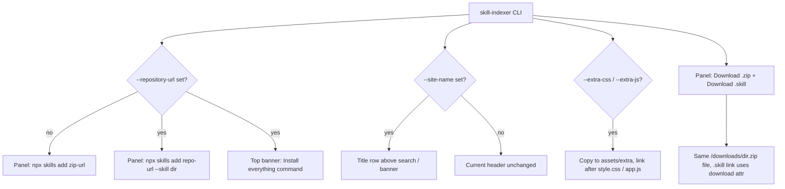
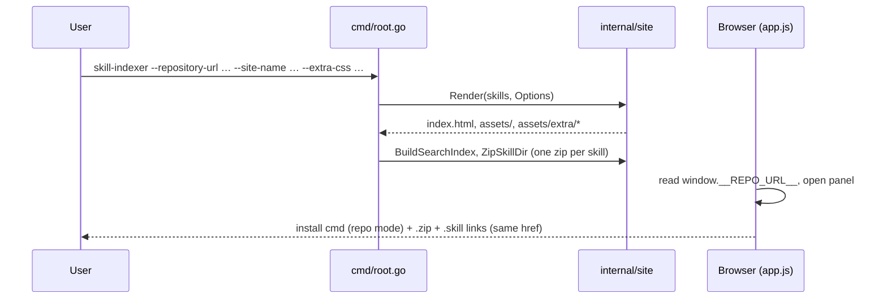

# Plan: Repository-URL install, .skill download, site name, and extra-asset theming

## Overview

Add four opt-in generator features to `skill-indexer`: a `--repository-url` flag that switches the
npx install command from zip URL to git repo URL (plus an "Install everything" banner), a
"Download .skill" option that reuses the existing zip file, a `--site-name` flag that adds a title
row above search, and `--extra-css` / `--extra-js` flags for theming, with an ASDP Wave CSS theme
kept out of git. All defaults preserve current behavior.

> Original request item 1 (rename `asdp-(action)-(context)` skills) and its `best-practice-*`
> follow-up were **dropped by the user** — those skills live in a different repo.

### Flowchart

### Sequence

## Context

- `cmd/root.go` holds flags (`--skill-dir`, `--output-dir`, `--base-url`) as package vars and calls
  `site.Render(skills, outputDir, base)`. Adding three more positional params would be unwieldy.
- `internal/site/render.go` renders one page (`templates/index.html.tmpl`) and embeds `assets/`
  (`style.css`, `app.js`, `fuse.min.js`). `indexPageData` carries `Title`, `Version`, `BaseURL`, `Skills`.
- `internal/site/searchindex.go` emits `zipPath` per entry (`<base>/downloads/<dir>.zip`). No repo info.
- `internal/site/assets/app.js` `updateInstallCommand()` builds
  `npx skills add <origin><zipPath> -a claude-code -y[-g]`; scope toggle state is `installScope`.
- Header today is a single row: wordmark | search | theme toggle (`.site-header`, `style.css`).
- Theming tokens are `--color-*` in `:root`, mirrored in `:root[data-theme="dark"]` and the
  `prefers-color-scheme` block (Nord dark). AGENTS.md requires both blocks stay identical.
- The Zensical theme `~/devops/pipelines/asdp-ci-pipelines/scripts/deploys/zensical/asdp-wave.css`
  targets `.md-*` classes, so it cannot be copied verbatim; only its **tokens and design rules**
  port over: `--asdp-*` palette (primary `#1e398d`, cyan `#00aeef`, ribbon gradient), light scheme
  plus dark "slate" scheme (bg `#14182a`, fg `#edeef3`, accent `#6c91ec`, code bg `#1d2130`),
  Montserrat headings with tight letter-spacing, Manrope body, JetBrains Mono code, 4px ribbon bar
  under header, radii 6/10/16, cool shadows, cyan focus ring, 140ms transitions honoring reduced motion.
- Layout reference `~/devel/devops/gitlab-docs-indexer/docs-indexer-web/src/App.vue` +
  `components/AppHeader.vue`: title block (bold display-font h1, muted subtitle) on the left, theme
  toggle on the right, content controls (search) below, ribbon-gradient footer.
- `search-index.json` must stay lean; repo URL is global, so it goes in an inline `window.__REPO_URL__`
  like `window.__BASE_URL__`, not per entry.

## Objective

Done when all hold, each checkable by script:

1. Without new flags, generated `public/` is identical to today's output except the new `.skill` anchor in `index.html` and the changed `app.js`.
2. With `--repository-url URL`: panel install command is `npx skills add URL --skill <name> -a claude-code -y[-g]`; an "Install everything" block with its own copy button appears in the top area; zip command unchanged when flag absent.
3. Each panel has "Download .zip" and "Download .skill" links pointing at the same `/downloads/<dir>.zip`; no `.skill` file exists on disk; `.skill` link carries `download="<dir>.skill"`.
4. `--extra-css a.css --extra-js b.js` (repeatable) copies files to `assets/extra/` and links them after `style.css` / `app.js`; missing file fails generation.
5. `--site-name "X"` renders an `<h1>` with X above search (and banner); default output has no `<h1>` site-name row.
6. `themes/asdp-wave.css` exists locally, is gitignored, and re-skins both light and dark modes when passed via `--extra-css`. No `asdp-wave.js` (CSS suffices).
7. `go build ./... && go vet ./... && gofmt -l . && go test ./...` clean.

## References

- `cmd/root.go` — flag definitions, `runGenerate`, `writeDownloads`.
- `internal/site/render.go` — `Render`, `indexPageData`, `writeAssets`.
- `internal/site/searchindex.go` — `zipPath` per entry.
- `internal/site/templates/index.html.tmpl` — header, panel actions, script tags.
- `internal/site/assets/app.js` — `updateInstallCommand`, `populatePanel`, copy button, scope toggle.
- `internal/site/assets/style.css` — tokens, `.site-header`, `.panel-actions`, `.install-block`.
- `DESIGN.md` — normative Do's/Don'ts for new UI.
- `AGENTS.md` — conventions (both theme blocks, base-url sync, no build step, no serve command).
- `.agents/plans/001-skill-marketplace-generator.md` — original decisions (zip layout, single page).
- `docs/operator-guides/configuration.md`, `docs/developer-guides/pitfalls.md`, `README.md` — docs to update.
- `~/devops/pipelines/asdp-ci-pipelines/scripts/deploys/zensical/asdp-wave.css` — theme source.
- `~/devel/devops/gitlab-docs-indexer/docs-indexer-web/src/App.vue`, `components/AppHeader.vue` — layout source.

## Constraints / Scope

**In scope:**
- Flags `--repository-url`, `--site-name`, `--extra-css`, `--extra-js` (last two repeatable).
- Repo-mode install command + "Install everything" banner (scope toggle shared with panel).
- `.skill` download link via `download` attribute on the existing zip.
- `themes/asdp-wave.css` (gitignored) ported from Zensical tokens/rules.
- Tests, README/docs/AGENTS.md updates.

**Out of scope:**
- Renaming `asdp-*` skills (other repo; user dropped it).
- Emitting a real second `.skill` file / hardlink / symlink.
- Embedding the theme in the binary; a `--theme` flag; `asdp-wave.js`.
- Hiding zip/.skill downloads in repo mode (both stay).
- A `serve` subcommand, CSS framework, or JS build step (AGENTS.md).
- Site-name subtitle/stat tiles from AppHeader.vue (only the title + layout position).

**Non-negotiables:**
- Defaults unchanged when no new flag is set.
- Base-url handling stays in sync: every new root-relative ref (extra assets) is prefixed by `BaseURL`.
- Light/dark token blocks stay identical in variable sets; wave theme overrides all three blocks.
- `prefers-reduced-motion` respected; focus trap/`inert` behavior untouched.
- `themes/` must be in `.gitignore`; never `git add` its contents.
- Logging stays in `cmd/`; `internal/site` returns errors.
- Branch `<model>/feature/<slug>` from `main`; Conventional Commits; no push/merge to `main` without approval.
- Track work as GitLab issues per user's roadmap convention before implementing.

## Tasks

### Task 1: Introduce site.Options and wire the four new flags
- **Status**: pending
- **Date**: 2026-09-29
- **Related file**: `cmd/root.go`, `internal/site/render.go`
- **Objective**: Replace `Render(skills, outputDir, baseURL)` with `Render(skills, outputDir, Options)` where `Options{BaseURL, RepoURL, SiteName string; ExtraCSS, ExtraJS []string}`; add cobra flags (`StringSliceVar` for extras) and normalize `--repository-url` (trim space and trailing `/`). Extend `indexPageData` with the new fields. Log new fields in `generate_start`.
- **Verification**: `go build ./... && go test ./...` pass; `go run . --help` lists all four flags.

### Task 2: Copy and link extra CSS/JS (depends on Task 1)
- **Status**: pending
- **Date**: 2026-09-29
- **Related file**: `internal/site/render.go`, `internal/site/templates/index.html.tmpl`
- **Objective**: In `Render`, copy each extra file to `<out>/assets/extra/<basename>`; error on unreadable file, directory, wrong extension (`.css`/`.js`), or duplicate basename across both lists. Template emits `<link rel="stylesheet">` after `style.css` and plain `<script src>` after `app.js`, each prefixed by `BaseURL`.
- **Verification**: `go run . --skill-dir examples/skills --output-dir /tmp/o --extra-css x.css` then `grep 'assets/extra/x.css' /tmp/o/index.html` and `test -f /tmp/o/assets/extra/x.css`; passing a nonexistent path exits non-zero.

### Task 3: Render site-name title row (depends on Task 1)
- **Status**: pending
- **Date**: 2026-09-29
- **Related file**: `internal/site/templates/index.html.tmpl`, `internal/site/assets/style.css`
- **Objective**: When `SiteName` is set, header becomes: row 1 `<h1 class="site-title">` (left) + theme toggle (right); below it the install-everything block (if any, Task 4) then search. Wordmark hidden and `<title>` uses site name. Without the flag, header markup/layout is unchanged. Follow `DESIGN.md` (flat, tokens only).
- **Verification**: generate with `--site-name "ASDP Skills"`; `grep -c '<h1 class="site-title">ASDP Skills</h1>' public/index.html` = 1; without flag the grep = 0.

### Task 4: Repo-mode install commands and "Install everything" banner (depends on Task 1)
- **Status**: pending
- **Date**: 2026-09-29
- **Related file**: `internal/site/templates/index.html.tmpl`, `internal/site/assets/app.js`, `internal/site/assets/style.css`
- **Objective**: Emit `window.__REPO_URL__` inline (only when set). `updateInstallCommand` builds `npx skills add <repo> --skill <name> -a claude-code -y[-g]` in repo mode, unchanged otherwise. Add a server-rendered `{{if .RepoURL}}` banner with command `npx skills add <repo> --skill '*' -a claude-code -y[-g]`, its own copy button, and scope toggle synced with the panel's `installScope`. Reuse the existing copy-button function rather than duplicating it a third time.
- **Verification**: generate with `--repository-url https://example.com/g/skills.git`; `grep -c 'install-all' public/index.html` ≥ 1 and `grep '__REPO_URL__' public/index.html`; without flag both greps empty. Manual/Playwright: open panel, `#install-cmd` text starts with `npx skills add https://example.com/g/skills.git --skill `.

### Task 5: Add "Download .skill" link on the same zip (depends on Task 1 for template plumbing only)
- **Status**: pending
- **Date**: 2026-09-29
- **Related file**: `internal/site/templates/index.html.tmpl`, `internal/site/assets/app.js`
- **Objective**: Add `<a id="panel-download-skill" class="button" download>Download .skill</a>` beside the zip button. `populatePanel` sets `href = entry.zipPath` and `download = entry.dirName + ".skill"`; the zip link gets `download = entry.dirName + ".zip"`. No new file is written to `downloads/`. Note merge overlap with Task 4 in `app.js`/template.
- **Verification**: after generation `ls public/downloads | grep -c '\.skill$'` = 0; `grep panel-download-skill public/index.html` matches; Playwright: link `href` equals zip link `href`, `download` attr ends `.skill`.

### Task 6: Create gitignored asdp-wave.css theme (depends on Tasks 3, 4, 5 for class names)
- **Status**: pending
- **Date**: 2026-09-29
- **Related file**: `themes/asdp-wave.css`, `.gitignore`, `.dockerignore`
- **Objective**: Add `/themes/` to `.gitignore` and `themes/` to `.dockerignore`. Write `themes/asdp-wave.css` porting the Zensical Wave tokens to skill-indexer's `--color-*`/`--font-*`/`--radius-*` variables, in all three places (`:root`, `:root[data-theme="dark"]`, `@media (prefers-color-scheme: dark) :root:not([data-theme="light"])`), with dark = Wave slate (not Nord). Add Google Fonts `@import` for Montserrat/Manrope/JetBrains Mono, Montserrat headings (`.site-title`, `.panel-name`, `.card-name`), 4px ribbon `::after` on `.site-header`, cyan focus ring, 140ms color transitions disabled under `prefers-reduced-motion`. Use `/frontend-design` + `/design-test-frontend` per user rules. No JS file.
- **Verification**: `git check-ignore themes/asdp-wave.css` prints the path; `git status --porcelain` shows no `themes/`; `grep -c 'data-theme="dark"\|prefers-color-scheme' themes/asdp-wave.css` ≥ 2; generate with `--extra-css themes/asdp-wave.css` and screenshot both themes with Playwright to confirm primary `#1e398d` on the CTA in light and slate bg `#14182a` in dark.

### Task 7: Unit tests for new behavior (depends on Tasks 1–5)
- **Status**: pending
- **Date**: 2026-09-29
- **Related file**: `internal/site/render_test.go`, `cmd/root_test.go` (new)
- **Objective**: Test: extras copied + linked with base-url prefix; duplicate basename and missing file error; site-name h1 present/absent; repo URL inline var + banner present/absent; `.skill` link markup present and no `.skill` file written; repo-URL normalization.
- **Verification**: `go test ./... -run 'Extra|SiteName|Repo|Skill' -v` shows new tests passing; full `go test ./...` passes.

### Task 8: Update docs and AGENTS.md (depends on Tasks 1–6)
- **Status**: pending
- **Date**: 2026-09-29
- **Related file**: `README.md`, `docs/operator-guides/configuration.md`, `docs/user-guides/browsing-and-installing-skills.md`, `docs/developer-guides/pitfalls.md`, `AGENTS.md`
- **Objective**: Document the four flags, repo-mode command shape, `.skill` = renamed zip (and cross-origin `download` caveat), theme workflow (`themes/` gitignored, pass via `--extra-css`), and add new call sites to the AGENTS.md "keep in sync" list. Fix AGENTS.md if it states the install command is zip-only.
- **Verification**: `grep -l -- '--repository-url' README.md docs -r` lists ≥ 2 files; `grep -- '--site-name\|--extra-css' docs/operator-guides/configuration.md` matches.

### Task 9: End-to-end check
- **Status**: pending
- **Date**: 2026-09-29
- **Related file**: `examples/skills/`
- **Objective**: Run generator with all flags on `examples/skills`, serve `public/` with a static server under `--base-url /marketplace`, and confirm assets, extras, panel commands, and downloads resolve.
- **Verification**: `go run . --skill-dir examples/skills --output-dir public --base-url /marketplace --repository-url https://example.com/g/skills.git --site-name "ASDP Skills" --extra-css themes/asdp-wave.css`; `curl -sf localhost:PORT/marketplace/assets/extra/asdp-wave.css` and `/marketplace/downloads/find-skills.zip` return 200; gofmt/vet/test clean.

## FAQ

1. Repo-mode `--skill <dirName>`: the third-party `skills` CLI matches `--skill` against the skill's frontmatter `name`, not the directory name (as far as I know). In this repo `Skill.Name` and `Skill.DirName` can differ (both exist in `cardView`/`searchEntry`). Should the command use `entry.name` or `entry.dirName`? Has `--skill <x>` been verified against a real `npx skills add <git-url>` run for both?

   **Answer:** Use `entry.name` (frontmatter name), since that is what `skills --skill` matches. `dirName` stays for zip paths only. Task 4 verifies this against a real local run (`git init` a copy of `examples/skills`, then `npx skills add <path> --skill <name>`); if it cannot be run offline, keep `name` and note it as unverified in the PR.
2. "Install everything" command: is `--skill '*'` confirmed to be valid in the `skills` CLI, or should it be `--all` (or no `--skill` flag at all, with `-y`)? Please confirm the exact intended string, including whether the quotes around `*` belong in the displayed command (zsh/bash need them, Windows cmd does not).

   **Answer:** Default to `--skill '*'` with single quotes shown in the command (POSIX shells). During Task 4 run `npx skills add --help`; if it documents `--all` as the canonical form, switch to that. Windows cmd quoting is documented, not handled.
3. Repo layout assumption: repo mode assumes the git repo at `--repository-url` contains the skills so `skills` can discover them (root, `skills/`, or `.claude/skills/`). The generator's `--skill-dir` can be any path. Should the generator validate or document this, or is it purely the operator's responsibility? Also, should a ref/branch be supported (`#branch` suffix), or is the plain URL enough?

   **Answer:** Operator responsibility; document in `configuration.md` that the repo must contain the skills in a layout `skills` can discover. Pass the URL through verbatim (no `#ref` parsing, no validation beyond trimming whitespace and trailing `/`).
4. Objective 1 says output is byte-identical without new flags, except the `.skill` link. But the `.skill` button (Task 5) is always rendered, not opt-in, which contradicts the Overview line "All defaults preserve current behavior". Confirm the `.skill` link is intentionally unconditional, and that the sole allowed diff is `index.html` (new anchor) plus `app.js` (changed asset).

   **Answer:** `.skill` link is intentionally unconditional. Objective 1 is reworded: without new flags, the only allowed diffs are the new `.skill` anchor in `index.html` and the changed `app.js`. Overview line "defaults preserve current behavior" means no flag-driven change, not zero markup change.
5. `.skill` link is the same-origin zip with a `download` attribute. The `download` attribute is ignored cross-origin (e.g. if the zip is served from a CDN or a different host). Since `zipPath` is always root-relative, is this caveat only documentation-worthy, or do you want any fallback? Also confirm that a `.skill` file is expected to be a zip with the `<dirName>/SKILL.md` layout (current zip entries are prefixed with `DirName`), since Claude's own `.skill` packaging may expect the skill folder at the archive root; I would leave it as is.

   **Answer:** Documentation only, no fallback. Leave zip layout as is (`<dirName>/SKILL.md` at archive root already puts the skill folder at the root). Docs state `.skill` is just the zip renamed.
6. Header layout: the plan says site-name mode hides the wordmark and puts the h1 plus theme toggle in row 1, then the banner, then search. Where does the "Install everything" banner go when `--repository-url` is set but `--site-name` is not (default single-row header with wordmark | search | toggle)? Options: a new row inside `.site-header` below the row, or a separate strip between header and `<main>`. Also, in site-name mode, should the header become a stacked layout (block/flex-column) and should `.site-header` stay sticky if it currently is? I have not yet checked the sticky behavior and will follow whatever the current CSS does unless told otherwise.

   **Answer:** Banner is a second row inside `.site-header` (spanning all grid columns), so `inert` handling needs no change. Header stays sticky. In site-name mode the header stacks (title row, banner, search). Check screenshots at 375px and 1280px; if the header exceeds ~30vh on mobile, set `position: static` below 640px.
7. `<title>` and footer: with `--site-name` the `<title>` becomes the site name. Should the footer trademark ("Skill Indexer vX | by ndkprd") and the `wordmark` link text remain untouched? And the `Version` const in `render.go` is `0.1.1` while the changelog is at v0.2.0. Should I leave it alone (out of scope) or bump it?

   **Answer:** Footer trademark untouched. Wordmark hidden only in site-name mode; `<title>` uses the site name. Leave the `Version` const (0.1.1 vs changelog 0.2.0) alone — out of scope, mention it in the PR.
8. Shared install state: the panel and banner each need an install command, copy button and scope toggle, but the existing code uses fixed ids (`install-cmd`, `copy-cmd`) and a global `.scope-option` query, so a second block would duplicate ids. I plan to switch to class/data-attribute hooks (e.g. `data-install-block`, `data-install-cmd`) and rename the ids, with a `bindCopyButton(button, getText)` helper and a single `setScope`. Is renaming `#install-cmd` acceptable? Task 4's verification and the Playwright check quote `#install-cmd`, so I would keep `id="install-cmd"` on the panel block only. Confirm.

   **Answer:** Confirmed. Keep `id="install-cmd"` and `id="copy-cmd"` on the panel block only; banner uses `data-install-*` / `install-all-*` hooks. Extract one `bindCopyButton(button, getText)` and one `setScope`, shared by both blocks (no third copy of the logic).
9. Focus trap and `inert`: the banner lives inside `.site-header` (inert while the panel is open) so no change is needed there. But if the banner is placed outside header/main/footer (see Q6), `setInertOutsidePanel` would miss it. Which placement do you prefer, or should I extend that selector list?

   **Answer:** Banner lives inside `.site-header`, so `setInertOutsidePanel` needs no change. Add a test/verification that the banner is inside `header`.
10. Extra files: (a) `assets/extra/<basename>` is shared between CSS and JS; should the duplicate-basename check cover both lists together (a.css and a.js are fine, a.css twice or `x/a.css` + `y/a.css` error)? (b) The extra `<script>` uses `defer` while `app.js` is loaded without it. Should the extra JS run before or after `app.js` initializes (it loads after in DOM order, `defer` runs after parsing, so it may run after `app.js`'s `DOMContentLoaded` handler is registered but that is fine)? Confirm `defer` is what you want vs plain blocking like `app.js`. (c) Should a directory or non-`.css`/`.js` extension be rejected, or accept any file?

   **Answer:** (a) One duplicate check across both lists, keyed by basename (`a.css`+`a.js` fine, same basename twice errors). (b) Use plain blocking `<script src>` placed right after `app.js`, matching it; Task 2 is updated (no `defer`). (c) Reject directories; require `.css` for `--extra-css` and `.js` for `--extra-js`.
11. `themes/asdp-wave.css` is gitignored and not embedded, so it will not be in the Docker image or CI. Task 9 and Objective 6 rely on it existing locally. Should the `Dockerfile`/`.dockerignore` and `examples/.gitlab-ci.yml` stay unaware of it (operators mount their own CSS), and should `.dockerignore` also list `themes/`? Also confirm the theme should only contain ASDP brand assets/fonts references that are acceptable to keep private (fonts via Google `@import` add third parties beyond the two Google Fonts requests AGENTS.md already allows; fine because it is opt-in?).

   **Answer:** Dockerfile and CI stay unaware; operators mount their own CSS. Add `themes/` to `.dockerignore` alongside `.gitignore`. The Google Fonts `@import` inside the theme is acceptable because the theme is opt-in and private.
12. Theme scope: the Wave theme must override `--color-*`, `--font-*`, `--radius-*` in all three blocks, but I have not yet enumerated the actual token names in `style.css` (only `.site-header` at line 174 and 660 are duplicated there, suggesting a responsive override). Is it acceptable for me to add missing tokens to `style.css` (keeping light/dark blocks identical, as AGENTS.md requires) if the theme needs something not yet tokenized (e.g. `--font-display`, `--shadow-*`, ribbon gradient), or must the theme work with the existing token set only?

   **Answer:** Yes, may add missing tokens to `style.css` (e.g. `--font-display` defaulting to `--font-sans`), identical in all three blocks. Prefer the existing token set; the ribbon bar is theme-only via `::after`, no token.
13. Process: the user rules require tracking work as GitLab issues (`workflow::*` labels, `<iid>-<slug>` branches), while AGENTS.md requires `<model-name>/<feature|fix|refactor>/<slug>` branches. Which naming wins for this work? Should I create one issue per task (9 issues) or one epic-style issue for the plan, and does this repo have a GitLab remote configured (the footer links to `gitlab.com/endekasoft/skill-indexer`)? Also commit granularity: one commit per task (Conventional Commits, scope e.g. `feat(site)`), correct?

   **Answer:** Branch naming follows the project AGENTS.md: `<model-name>/feature/<slug>`. Per-task GitLab issues are created only with the user's go-ahead at implementation time (this project is open source; confirm target before publishing anything). One Conventional Commit per task (e.g. `feat(site): ...`).
14. Skill-tool rules: Task 6 and the header work call for `/frontend-design` and `/design-test-frontend`, and the repo has `DESIGN.md`/`PRODUCT.md`. `/design-test-frontend` is not in my available skills list (only `frontend-design`, `impeccable`, `playwright-cli`, `web-design-guidelines`, etc.). Which should I substitute for the design test (e.g. `playwright-cli` screenshots plus `web-design-guidelines`), or skip?

   **Answer:** `/design-test-frontend` is unavailable here; substitute `playwright-cli` screenshots (light + dark, 375px + 1280px) plus `web-design-guidelines`.
15. Tests: existing `render_test.go` calls `Render(skills, dir, baseURL)`. Changing the signature means updating those call sites (not a behavior change). Also `cmd/root_test.go` is new and `cmd` has package-level flag vars, so a `normalizeRepoURL` test is easy but flag-parsing tests are not. Is it enough to unit-test the normalization functions (`normalizeBaseURL`, new `normalizeRepoURL`) and not the cobra wiring?

   **Answer:** Enough: unit-test `normalizeBaseURL` and the new `normalizeRepoURL`, plus site-level tests through `site.Render`. Cobra wiring is covered by Task 9's end-to-end run. Existing `Render` call sites in `render_test.go` get updated for the new signature.
