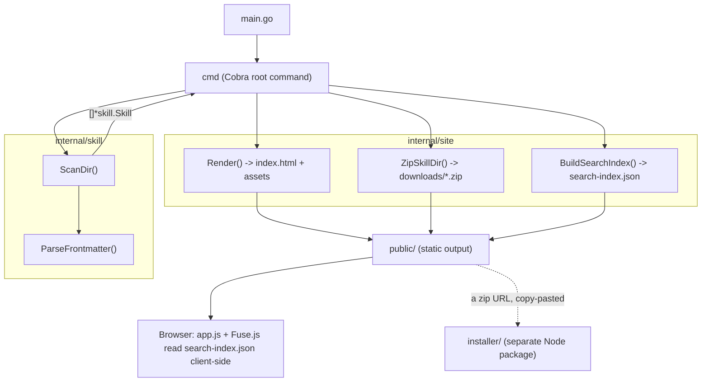

# Architecture

## Components



`internal/skill` only knows how to turn `SKILL.md` files into `Skill`
values; `internal/site` only knows how to turn `[]*skill.Skill` into
output files. Neither package logs — `cmd` owns all logging, so the two
packages stay usable as plain libraries. The `installer/` Node package is
entirely decoupled from the Go binary: it only ever talks to it indirectly,
by fetching a zip URL a generated site printed.

## The generate pipeline (sequence)

```mermaid
sequenceDiagram
    participant User
    participant Cmd as cmd.runGenerate
    participant Skill as internal/skill
    participant Site as internal/site
    participant FS as Filesystem

    User->>Cmd: skillstore --skill-dir X --output-dir Y
    Cmd->>FS: RemoveAll(Y); MkdirAll(Y)
    Cmd->>Skill: ScanDir(X)
    loop each subdirectory of X
        Skill->>Skill: ParseFrontmatter(dir/SKILL.md)
    end
    Skill-->>Cmd: []*Skill, []warning
    Cmd->>Cmd: log one skill_skipped warning per failure
    Cmd->>Site: Render(skills, Y)
    Site->>FS: write Y/index.html, Y/assets/*
    loop each skill
        Cmd->>Site: ZipSkillDir(skill, Y/downloads/<name>.zip)
    end
    Cmd->>Site: BuildSearchIndex(skills)
    Site-->>Cmd: JSON bytes
    Cmd->>FS: write Y/search-index.json
```

This diagram shows why a single bad skill never fails the whole run:
`ScanDir` collects warnings rather than returning an error, and everything
downstream only ever sees the skills that parsed successfully.

## What happens in the browser

There are no per-skill server routes or pages. `index.html` ships a card
per skill (name, description, up to two metadata badges) rendered
server-side by `internal/site`. Clicking a card doesn't navigate anywhere —
`app.js` opens a slide-in panel and populates it from `search-index.json`,
which it already fetched once on page load for search. The panel's open/
closed state lives in the URL hash (`#<skill-name>`), so it's deep-linkable
and works with the browser's back button without any server involvement.

## Related

- [Stack](./stack.md) — the specific libraries behind each component above
- [Pitfalls](./pitfalls.md) — non-obvious decisions embedded in this design (zip entry prefixing, metadata folding, why there's only one template)
