# Deployment

Skill Indexer's output is plain static files (`index.html`, `assets/`,
`downloads/*.zip`, `search-index.json`). Once generated, host it anywhere
that serves static files — the four paths documented here (Docker, Docker
Compose, Kubernetes, GitLab Pages) cover generation and a couple of common
publishing targets, but any static host works equally well.

```mermaid
graph TD
    subgraph Local_or_Docker["Local / Docker"]
        A[skill-indexer CLI] -->|writes| B["public/"]
        B --> C[Any static file server]
    end
    subgraph Compose["Docker Compose"]
        G["generate service (skill-indexer, one-shot)"] -->|shared volume| H["web service (nginx)"]
    end
    subgraph K8s["Kubernetes Deployment"]
        I["initContainer: fetch-skills (git clone)"] --> J["initContainer: generate-site (skill-indexer)"]
        J -->|emptyDir volume| K["container: nginx"]
    end
    subgraph GitLab_CI["GitLab CI"]
        D[git push] --> E["pages job: go build + run skill-indexer"]
        E -->|artifact: public/| F[GitLab Pages]
    end
```



The CLI only generates files; it does not serve HTTP itself in any path —
a separate static file server (nginx, GitLab Pages, or whatever else you
choose) always does the serving.

## Docker

Build the image once (see [Installation](./installation.md)), then run it
against a mounted skills directory and output directory:

```bash
docker build -t skill-indexer .

docker run --rm \
  -v "$(pwd)/skills:/skills:ro" \
  -v "$(pwd)/public:/public" \
  skill-indexer --skill-dir /skills --output-dir /public
```

The container exits after generating; `./public` on the host now has the
site. Serve it with whatever you'd normally use for static files (nginx,
Caddy, a CDN origin, etc.) — the Skill Indexer image itself is not a web
server.

**Resource footprint**: the compiled binary is a few megabytes with no
runtime dependencies; generating dozens of skills takes well under a
second and needs no more than default container CPU/memory limits.

## Docker Compose

```bash
docker compose -f examples/docker-compose.yaml up --build
```

`examples/docker-compose.yaml` defines two services: `generate` builds the
CLI from the repository `Dockerfile` and runs it once against
`examples/skills/` into a shared named volume, then exits; `web` (nginx)
waits for `generate` to finish successfully
(`depends_on.generate.condition: service_completed_successfully`) and
serves that volume at `http://localhost:8080`.

The distroless image runs as a non-root user by default; the `generate`
service overrides that to root (`user: "0:0"`) purely because the shared
volume is empty and unwritable by a non-root UID on first mount — it's a
one-shot job that exits immediately, not a standing service, so this
doesn't carry the same risk it would for `web`.

To use your own skills, copy the compose file (and the `Dockerfile`) into
your project and point `generate`'s `./skills` volume elsewhere.

## Kubernetes

`examples/kubernetes.yaml` is a Deployment template — it needs your own
image reference and skills repository URL filled in before it's
applicable, not something to `kubectl apply -f` unmodified. Structure:

1. **`fetch-skills` init container** (`alpine/git`) clones your skills
   repository into a per-pod `emptyDir` volume.
2. **`generate-site` init container** (your built Skill Indexer image) reads
   that volume and writes the generated site into a second `emptyDir`
   volume. Like the Compose example, it runs as root
   (`securityContext.runAsUser: 0`) only to write into that freshly-empty
   volume.
3. **`nginx` container** mounts the second volume read-only and serves it,
   with a readiness probe and resource requests/limits set.

A `Service` in the same file exposes the Deployment on port 80. See the
file's own comments for the two substitutions required
(`registry.gitlab.com/endekasoft/skill-indexer:latest` and the real skills repo URL) and a
note on the tradeoff of per-replica clone+generate versus a shared
PersistentVolume for larger skill sets.

## GitLab Pages via CI

1. Copy `examples/.gitlab-ci.yml` to `.gitlab-ci.yml` at your repository
   root (adjust `--skill-dir` if your skills aren't at `skills/`).
2. Push to your default branch.

```yaml
pages:
  stage: deploy
  image: golang:1.27
  script:
    - go build -o skill-indexer .
    - ./skill-indexer --skill-dir skills --output-dir public
  artifacts:
    paths:
      - public
  rules:
    - if: $CI_COMMIT_BRANCH == $CI_DEFAULT_BRANCH
```

GitLab Pages has exactly two requirements this satisfies: a job literally
named `pages`, and a `public/` artifact directory. The published URL
follows the pattern `https://<namespace>.gitlab.io/<project>/` — GitLab
shows the exact URL under **Deploy → Pages** once the job succeeds.

See [examples/README.md](../../examples/README.md) for the same
instructions alongside a direct-generate quickstart.

## The npx install command depends on a third-party package

Every generated site shows an `npx skills add <zip-url> ...` command as
one of two ways to get a skill. `skills` is
[`vercel-labs/skills`](https://github.com/vercel-labs/skills) — an
already-published, actively maintained third-party CLI, not anything this
project ships. Nothing needs to be published or configured by you for this
to work, unlike an earlier version of this project that shipped its own
unpublished `installer/skillstore-install` package (from when this
project was still called "Skillstore"). The only real
precondition is the visitor's own environment: `skills` requires Node.js
22.20+.

## Site branding

The generated footer's "Skill Indexer vX.Y.Z | by ndkprd" attribution and its
links are hardcoded in the template — see
[Configuration → Site branding](./configuration.md#site-branding) if you
need to change or remove it before publishing your own site.

## Related

- [Installation](./installation.md) — building the CLI or the Docker image
- [Troubleshooting](./troubleshooting.md) — diagnosing a pipeline or image that isn't producing output
