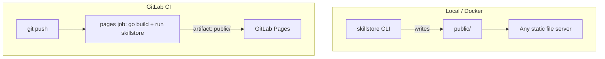

# Deployment

Skillstore's output is plain static files (`index.html`, `assets/`,
`downloads/*.zip`, `search-index.json`). Once generated, host it anywhere
that serves static files — the two paths documented here (Docker,
GitLab Pages) cover generation and one common publishing target, but any
static host works equally well.



The CLI only generates files; it does not serve HTTP itself in either path
— a separate static file server (or GitLab Pages) does the serving.

## Docker

Build the image once (see [Installation](./installation.md)), then run it
against a mounted skills directory and output directory:

```bash
docker build -t skillstore .

docker run --rm \
  -v "$(pwd)/skills:/skills:ro" \
  -v "$(pwd)/public:/public" \
  skillstore --skill-dir /skills --output-dir /public
```

The container exits after generating; `./public` on the host now has the
site. Serve it with whatever you'd normally use for static files (nginx,
Caddy, a CDN origin, etc.) — the Skillstore image itself is not a web
server.

**Resource footprint**: the compiled binary is a few megabytes with no
runtime dependencies; generating dozens of skills takes well under a
second and needs no more than default container CPU/memory limits.

## GitLab Pages via CI

1. Copy `examples/.gitlab-ci.yml` to `.gitlab-ci.yml` at your repository
   root (adjust `--skill-dir` if your skills aren't at `skills/`).
2. Push to your default branch.

```yaml
pages:
  stage: deploy
  image: golang:1.27
  script:
    - go build -o skillstore .
    - ./skillstore --skill-dir skills --output-dir public
  artifacts:
    paths:
      - public
  rules:
    - if: $CI_COMMIT_BRANCH == $CI_DEFAULT_BRANCH
```

GitLab Pages has exactly two requirements this satisfies: a job literally
named `pages`, and a `public/` artifact directory. The published URL
follows the pattern `https://<namespace>.gitlab.io/<project>/` — GitLab
shows the exact URL under **Deploy → Pages** once the job succeeds.

See [examples/README.md](../../examples/README.md) for the same
instructions alongside a direct-generate quickstart.

## npx install requires a published package

Every generated site shows an `npx skillstore-install <zip-url> ...`
command as one of two ways to get a skill. As of this writing, the
`skillstore-install` package (`installer/`) **has not been published to
the npm registry** — `npx` cannot resolve it, and the command will fail
with a "package not found" error for anyone who tries it. This was
explicitly scoped out of the original implementation plan as a follow-up,
not an oversight.

Before relying on the `npx` flow for real visitors, either:

- Publish `installer/` to the npm registry yourself (`npm publish` from
  that directory, after reviewing `installer/package.json`), or
- Treat the **Download .zip** button as the only working install path
  until you do.

## Site branding

The generated footer's "Skillstore vX.Y.Z | by ndkprd" attribution and its
links are hardcoded in the template — see
[Configuration → Site branding](./configuration.md#site-branding) if you
need to change or remove it before publishing your own site.

## Related

- [Installation](./installation.md) — building the CLI or the Docker image
- [Troubleshooting](./troubleshooting.md) — diagnosing a pipeline or image that isn't producing output
