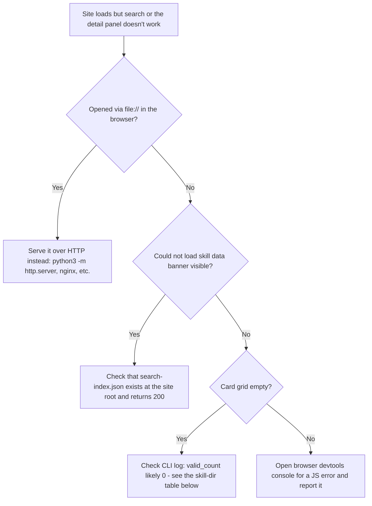

# Troubleshooting

## Log locations

Skillstore logs structured lines to **stderr only** — there is no log
file. Every run logs a `generate_start` event, one `skill_skipped` warning
per invalid skill, a `skills_scanned` summary, and a `generate_done` event
with the final count. There's no separate debug mode.

> **Nota:** that structured format covers everything logged _during_ a
> successful or partially-successful run. A fatal top-level error (for
> example `--output-dir` can't be created, or a disk write fails partway
> through) instead prints as a single plain-text line — `err.Error()` via
> `fmt.Fprintln` — not through the structured logger, and the process
> exits non-zero. Expect to see both styles of output on stderr depending
> on what went wrong.

## Diagnosing a site that loads but doesn't work

Fetch requests for `/search-index.json` and `/assets/*` fail under the
`file://` protocol in most browsers — this is the single most common cause
of "the page loads but nothing is interactive."

## Symptom → cause → fix

| Symptom                                                                                                                  | Likely cause                                                                                                                                    | Fix                                                                                                                                                |
| ------------------------------------------------------------------------------------------------------------------------ | ----------------------------------------------------------------------------------------------------------------------------------------------- | -------------------------------------------------------------------------------------------------------------------------------------------------- |
| CLI logs `skill_skipped` for a directory you expected to see                                                             | Missing `SKILL.md`, or `name`/`description` missing/empty, or malformed YAML frontmatter                                                        | Fix the file per [Configuration](./configuration.md#the-skillmd-format); the warning text names the exact directory and the underlying parse error |
| CLI logs `valid_count=0`                                                                                                 | `--skill-dir` points at the wrong path, or that directory has no subdirectories at all                                                          | Confirm the path exists and contains one subdirectory per skill (skills must be one level deep, not nested further)                                |
| CLI logs exactly one `skill_skipped` warning, then `valid_count=0`, and still **exits 0** with a complete but empty site | `--skill-dir` itself doesn't exist or can't be read — the CLI reports this the same way as a single bad skill, not as a directory-level failure | Read the warning's error text carefully: a "read skill dir ...: no such file or directory" message means the whole path is wrong, not one skill    |
| Generated site has stale content from a previous run                                                                     | Not possible via the CLI itself — `--output-dir` is fully cleared every run                                                                     | If you're not using the CLI's own generation but copying files manually, clear the target directory yourself first                                 |
| Search box shows "Search unavailable" / a "Could not load skill data" banner                                             | Browser couldn't fetch `search-index.json` (wrong serving root, `file://` protocol, or a broken proxy/CDN path)                                 | Serve the site over real HTTP with `search-index.json` at the site root; check the network tab for the actual failing request                      |
| `npx skills add ...` command copies but the URL looks wrong (e.g. `null` or `localhost` instead of your real domain)     | The command is built client-side from `window.location.origin` — it reflects whatever host the browser thinks it's on                           | Make sure the site is accessed via its real public URL, not a proxied path that rewrites the origin                                                |
| `npx skills add ...` fails with an engine/version error                                                                  | `skills` requires Node.js 22.20+; the visitor running the command has an older Node                                                             | Upgrade Node, or use the **Download .zip** button instead — it has no Node requirement at all                                                      |
| GitLab Pages job succeeds but the site 404s                                                                              | Job isn't named exactly `pages`, or `artifacts.paths` doesn't include `public`                                                                  | Compare against `examples/.gitlab-ci.yml` line by line                                                                                             |
| GitLab Pages job never runs on push                                                                                      | The `rules:` condition (`$CI_COMMIT_BRANCH == $CI_DEFAULT_BRANCH`) didn't match — you pushed to a non-default branch                            | Push to your default branch, or adjust the rule                                                                                                    |
| `docker build` fails while pulling the base image                                                                        | No network access to Docker Hub / `gcr.io` from the build machine                                                                               | Verify registry access, or pre-pull `golang:1.27` and `gcr.io/distroless/static-debian12:nonroot` on a machine that has it                         |

## Related

- [Configuration](./configuration.md) — the exact `SKILL.md` requirements referenced above
- [Deployment](./deployment.md) — Docker, Compose, Kubernetes, and GitLab Pages setups this section assumes
